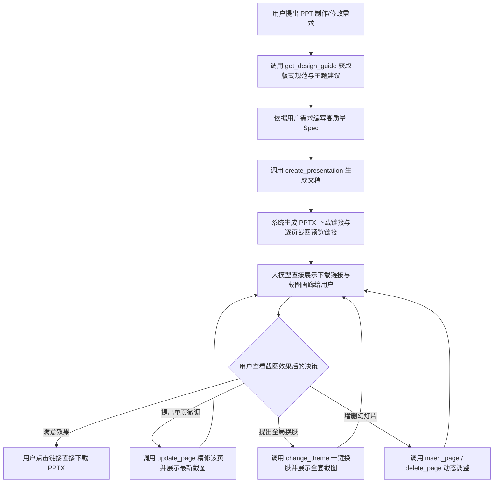

# pptx-studio

现代商业级声明式 PPTX 生成与用户交互展示服务（**FastAPI + MCP 同进程**）：
基于结构化 JSON Spec，自适应 9 大商务/科技与东方美学主题，支持架构拓扑画图、诗词歌赋韵律美学与大模型自主设计 HTML/CSS 配色。

**用户直观预览与极速出片机制**：
MCP 工具出片时会自动渲染出每一页的高清截图，并将**PPTX 文件的直接下载链接（download_url）与每一页的预览截图链接（preview_urls / Markdown 图文）**一次性返回给大模型。大模型无需消耗大量 Token 进行自主视觉审查，直接将下载链接与截图画廊列出给用户；用户通过截图确认效果后，可**直接点击下载**或通过自然语言接口要求**定向微调/全套换肤**。

---

## 🌟 核心特性

1. **丰富的现代化专业版式**：
   - **架构拓扑图（`diagram` / `topology`）**：原生矢量绘制的 2D 网格微服务调用拓扑图，支持节点类型徽章、定向调用箭头（如 `gRPC ➔`、`落盘 ▼`）与底部核心解耦原则卡，在 Office/WPS 中可自由拖拽二次编辑！
   - **分层技术架构（`stack` / `architecture`）**：分层系统组件与技术栈架构，带组件胶囊与层级指示。
   - **诗词歌赋韵律美学（`poetry`）**：支持词牌徽章、作者朝代、对仗诗句排版与朱砂印泥点缀，配合现代技术/战略「借诗明志」解读卡。
   - **Bento 栅格卡片（`grid`）**：2x2 四象限网格矩阵、四角均布，饱满高级。
   - **核心论断大字报（`hero_statement`）**：金句大字报与 3~4 个支柱微卡。
   - **业务演化流转（`process_flow`）**：强箭头指示的业务与数据流转卡片。
   - **对比与看板（`comparison` / `dashboard` / `kpi` / `table`）**：痛点解法对比、综合业务看板、指标高光卡与自适应斑马纹表格。
2. **9 大精调主题与大模型自由配色**：
   - 内置主题：政务稳重蓝（`gov_blue`）、顶尖咨询蓝（`business_blue`）、深空极客黑（`tech_dark`）、黑金尊享（`executive_gold`）、数字科技青（`modern_teal`）、清新生态绿（`fresh_green`）、活力珊瑚橙（`warm_coral`）、紫罗兰先锋（`violet`）、水墨丹青·东方雅韵（`chinese_poetry`）。
   - **大模型自主配色字典**：支持在 `theme` 中直接传入 Hex 配色字典（`bg`, `card_bg`, `primary`, `accent` 等），完全打破预设主题限制。
3. **用户直观审查与即时编辑闭环**：
   - 出片工具 `create_presentation` 自动返回 PPTX 下载链接与逐页截图 URL，大模型将其格式化后呈现给用户；
   - 提供 `update_page`（单页精修）、`change_theme`（一键换肤）、`insert_page`（插入页面）、`delete_page`（删除页面）等全套用户修改接口；
   - 彻底告别大模型死循环自审，把决策权交还给用户。
4. **自适应 Host 链接与时间排序命名**：
   - **时间前缀命名**：生成文件名默认以时间戳开头（如 `20260929_162028_gold_fund_pitch.pptx`），方便在目录中自然时间排序管理；同一秒并发自动追加防重短码；
   - **动态 Host 自动识别**：纯 ASGI 中间件实时捕获反向代理 `X-Forwarded-Host` / `Host` 头，或读取 `BASE_URL` 环境变量，自动拼接生成标准下载链接（如 `http://<host>:<port>/api/download/xxx.pptx`）。

---

## 快速开始

### 方式一：Docker Compose（推荐，开箱即用无头渲染）

镜像内置 `libreoffice-nogui` 以及完整的中文字体包（`fonts-noto-cjk`、`fonts-wqy-zenhei`、`fonts-wqy-microhei`），生成 PPTX 与截图预览完全开箱即用：

```bash
# 1. 启动服务（默认端口 48000，产物映射在宿主机 ./data 目录）
docker compose up -d --build

# 2. 查看日志与容器状态
docker compose logs -f
docker compose ps
```

访问测试：
- 健康检查：`curl http://127.0.0.1:48000/healthz`
- API 交互文档：`http://127.0.0.1:48000/docs`
- MCP 端点：`http://127.0.0.1:48000/mcp`

### 方式二：本地直接运行

```bash
pip install -r requirements.txt
# 启动服务（默认 0.0.0.0:48000，开发环境热重载）
uvicorn app:app --host 0.0.0.0 --port 48000 --reload
```

---

## 接入 MCP 客户端（Claude Desktop / Cursor / Cherry Studio 等）

在 MCP 配置文件中加入：

```json
{
  "mcpServers": {
    "pptx-studio": {
      "type": "http",
      "url": "http://127.0.0.1:48000/mcp"
    }
  }
}
```

---

## 🤖 大模型出片与用户交互工作流



### MCP 工具一览（14 个）

| 工具 | 作用 |
| --- | --- |
| `get_design_guide` | **核心设计指引**：返回 9 大主题、自由配色规范与现代版式指南（拓扑图、架构栈、诗词韵律、栅格、对比等） |
| `create_presentation` | **核心出片工具**：根据 spec 构建 PPTX，**返回 PPTX 下载链接与逐页截图预览链接**，附带图文 Markdown 供直接展示 |
| `update_page` | **单页精修工具**：针对某页内容或版式进行精准局部重构，并立即返回最新下载链接与该页截图链接 |
| `change_theme` | **一键换肤工具**：为整套文稿切换全新主题（或自定义配色字典），重新构建并返回全套最新预览图 |
| `insert_page` | **插入页面工具**：在指定位置插入新幻灯片并返回最新下载与截图链接 |
| `delete_page` | **删除页面工具**：删除指定幻灯片并重新生成文稿 |
| `list_themes` | 列出可用主题色彩体系及页面尺寸规格 |
| `list_templates` | 列出内置开箱即用的专业模板 |
| `get_template` | 获取内置模板的完整 Spec JSON |
| `validate_spec` | Spec 语法与结构完整性校验 |
| `render_preview` | 对已有产物重新生成预览图与访问链接 |
| `list_artifacts` | 查看已生成的 PPTX、PDF、PNG 产物列表 |
| `read_spec` | 读取已生成产物的原始 Spec JSON |
| `delete_artifact` | 删除历史产物 |
| `server_info` | 查询服务环境、无头渲染能力及配置状态 |

---

## 🎨 现代 Layout 版式与防空白设计


| Layout | 适用场景 | 防空白技巧与特性 |
| --- | --- | --- |
| `title_slide` | 封面页 | 左右非对称现代构图，左侧主标题与副标题，右侧大面积亮点卡片（highlights）与色块点缀 |
| `grid` | 核心支柱 / 四象限 / 架构方案 | 2x2 四宫格卡片或 1x3 核心优势卡片，带圆角白底（或暗色磨砂底）与主色高光点 |
| `comparison` | 方案对比 / 现状与目标 / 痛点解法 | 左右卡片对比，支持 `tag` 徽标、加粗标题与多条对照项目，视线饱满平衡 |
| `kpi` | 经营成果 / 财务指标 / 量化数据 | 顶部指标卡 + **底部自动生成 Takeaway 洞察分析卡片**，黄金分割排版，绝无下半屏空白 |
| `dashboard` | 经营大盘 / 综合看板 | 顶部大要点/概述 + 中部核心指标行 + 下部多栏面板（支持内嵌柱状图/进度条） |
| `table` | 详细对比表 / 参数清单 / 里程碑规划 | 表头主色高亮、奇偶行斑马纹，**下方配备总结底卡（takeaway）** |
| `bullets` | 逻辑要点 / 实施举措 | 自动将每条要点渲染为现代 Bento 积木块（带背景底色与左侧强调竖条），告别孤立小圆点 |
| `timeline` | 演进历程 / 项目路线图 | 节点圆环 + 连接横线 + 阶段说明卡片 |
| `section` | 章节过渡页 | 醒目的序列号徽章（如 `01 / SECTION`）与大标题 |

---

## Spec 结构示例

```jsonc
{
  "theme": "tech_dark",              // 推荐主题：business_blue / tech_dark / executive_gold / modern_teal
  "size": "16:9",
  "meta": { "title": "新一代 AI 架构方案", "author": "技术专家委员会" },
  "pages": [
    {
      "layout": "title_slide",
      "title": "新一代全场景 AI 基础设施",
      "subtitle": "高并发推理平台与智能 Agent 编排体系架构汇报",
      "highlights": ["10x 吞吐提升", "P99 延迟 < 50ms", "跨云多活保障"],
      "meta_line": "汇报人：AI 平台架构组  |  2026 年第 3 季度"
    },
    {
      "layout": "grid",
      "title": "核心能力四象限矩阵",
      "category": "架构规划",
      "cards": [
        { "title": "模型弹性分发", "tag": "算力调度", "desc": "毫秒级冷启动与权重分片加载，GPU 利用率提升至 [[85%]]。" },
        { "title": "端到端可观测", "tag": "稳定性", "desc": "全链路 Tracing 与显存热点检测，异常分钟级发现与自动熔断自愈。" },
        { "title": "Agent 协议生态", "tag": "开放互联", "desc": "原生兼容 MCP 标准协议，支持跨环境工具无缝动态注册与路由。" },
        { "title": "企业安全沙箱", "tag": "合规防护", "desc": "细粒度权限控制与敏感内容实时拦截过滤，通过等级保护三级认证。" }
      ]
    },
    {
      "layout": "kpi",
      "title": "Q3 业务关键业绩指标",
      "category": "成效度量",
      "kpis": [
        { "label": "调用峰值 QPS", "value": "128,000", "unit": "req/s" },
        { "label": "平均响应延迟", "value": "38", "unit": "ms" },
        { "label": "显存成本节省", "value": "42.5", "unit": "%" }
      ],
      "takeaway": "核心业务链路延迟降低 60%，算力集群整体资源开销降低 42.5%，提前达成全年度降本增效目标。"
    }
  ]
}
```

---

## 环境变量说明

| 变量 | 默认值 | 说明 |
| --- | --- | --- |
| `BASE_URL` / `PUBLIC_HOST` | 留空 | 外部访问的 Base URL（若留空则自动从请求的 `Host` / `X-Forwarded-Host` 头提取） |
| `PORT` | `48000` | 容器与服务监听端口 |
| `PPTKIT_WORKSPACE` | `/app/data` | 工作根目录（包含 output 与 store） |
| `PPTKIT_OUTPUT_DIR` | `/app/data/output` | PPTX / 预览图生成保存路径 |
| `PPTKIT_STORE_DIR` | `/app/data/store` | 产物持久化元数据索引路径 |
